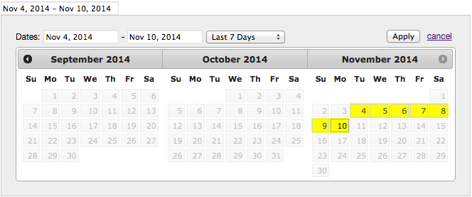

# jQuery Date Range Picker

A date range plugin built on top of the jQuery UI Datepicker, inspired by the Google Analytics date range feature. This plugin aims to provide a datepicker solution for applications that support historical date range reporting options.

**Dependencies:**

 - jQuery
 - jQuery UI
 - Moment.js


## Usage

To get a minimal implementation of this plugin up an running:



**Require dependencies**

```html
<!-- css -->
<link rel="stylesheet" href="bower_components/jquery.ui/themes/base/theme.css">
<link rel="stylesheet" href="bower_components/jquery.ui/themes/base/datepicker.css">
<link rel="stylesheet" href="jquery-daterange-picker.css">

<!-- javascript -->
<script src="bower_components/jquery/dist/jquery.js"></script>
<script src="bower_components/jquery.ui/ui/datepicker.js"></script>
<script src="bower_components/moment/moment.js"></script>
<script src="jquery-daterange-picker.js"></script>
```
**The Date Range Picker should be bound to an input field and rendered inside of it's own container.**

```html
<input id="daterange" value="" readonly>
<div id="daterange-picker-container"></div>
```
**Initialize the date range picker**

```javascript
$('#daterange').dateRangePicker({
  container: '#daterange-picker-container',
  defaultDateRange: 'LAST_30_DAYS',
});
```

*Note:* `container` is required and must be passed with the appropriate id or class selector type string.


###Options:

####- `defaultDateRange`

This plugin ships with six predefined date range options:

- MONTH_TO_DATE
- YEAR_TO_DATE
- LAST_WEEK
- LAST_MONTH
- LAST_7_DAYS
- LAST_30_DAYS *(default date range)*

To change the default date range, pass in the `defaultDateRange` option with one of the other predefined dateranges.

```javascript
$('#daterange').dateRangePicker({
  container: '#daterange-picker-container',
  defaultDateRange: 'MONTH_TO_DATE',
});
```


## Testing

QUnit tests are located in the [tests](tests/test.js) folder, and can be executed by running [tests/index.html](tests/index.html) in your browser.


## License

jQuery Date Range Picker is [MIT Licensed](LICENSE.md)


## Related Libraries and Inspirations

* https://github.com/dangrossman/bootstrap-daterangepicker
* Google Analytics
